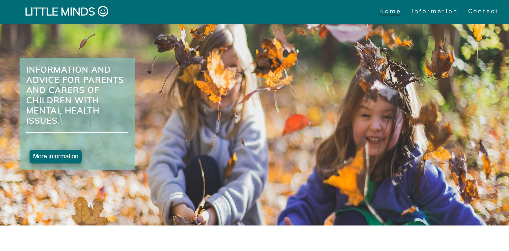

# Little Minds

This project Little minds is a website designed to help and give information to parents and carers of children with mental health issues. it contains links to useful tips and therapy booking session, videos of meditationand tips to keep a child well.

## Showcase

A deployed version of my website can be found [here.] (https://melwatts.github.io/LittleMinds/)

## navigation

* [UX](#ux)
  + [UX-stories](#ux-stories)
* [Strategy](#strategy)
  + [User-needs](#user-needs)
  + [Business-vision](#business-vision)
* [Scope](#scope)
* [Structure](#structure)
* [Wireframes](#wireframes)
  + [Changes](#changes-to-wireframes)
* [Features](#features)
* [Technologies](#technologies)
* [Testing](#testing)
  + [Testing-plan](#testing-plan)
  + [Implementation](#implementation)
  + [Results](#results)
* [Bugs](#bugs)
* [Deployment](#deployment)
* [Credits](#credits)
* [Content](#content)
* [Media](#media)
* [Acknowledgements](#acknowledgements)

## UX

User stories
## First time visitor goals

•	As a first time visitor, my aim is for parents  / carers of vulnerable children to feel there is help for them, they are not alone and my site will direct them to a solution
•	As a first time visitor, my aim is for people to be able to find what they are looking for very easily with an simple navigation through the site.

## Returning visitor goals:

•	As a returning visitor, my aim is for the site to be familiar and clear for the visitor to find what they were previously researching.
•	As a returning 

The end goal of the project is to help parents and carers if they are worreid about their childs behaviour and wellbeing. Providing them with links to professionals and youtubes vidoes of meditations and techniques.

### UX stories

* As a user I want to find help as I'm worried about my childs behaviour.
* As a user I want to find help as I'm worried about my childs wellbeing.
* As a user I want to know what help or support is out there.
* As a user I want to find out what professional therapy could I get for my loved one.
* As a user I want to find out some tips to keep my child well and happy.
* As a user I would like to feel I am not alone and things can be improved for my child and loved one.
* As a user I would like to know the signs of mental health issues so I can look out for them.

## Strategy

### User Needs

As a user the site has to be accessible on mobile, tablet and all browsers. Information should be clear to read, informative and helpful.
The site navigation needs to be optimal to move to the preferred section of the user.

### Business vision

The purpose of this project is to give users peace of mind and help is out there. 
The site also gives the users easy acces to external sites to talk to professionals, find other people to talk to in the same position, and watch meditation and mindful videos .

## Scope

I want my users to feel they are not alone, there are like minded parents / carers, professionals to talk to and generally help is out there for the ones they love. 

## Structure

This project is a 3 page website. with the home page being things that can help keep a young people mentally well. An inforamtion page where users can find links to various other website where they will find help, chat forums and professional consultaions. The third page is a contact form this is so users can reach out to the tam and they will guide them to the correct help and resources.

## Wireframes

The original wireframes can be found [here](assets/images/wireframe.JPG)

### Changes to wireframes

My site has changed considerably from the intial wireframe, as I had my initial idea and as I started to build my page it took me in another direction.

## Features

This section contains some of the features this project contains:
* The homepage will be the landing page showing a large hero image to draw people in, and a short paragraph showcasing how the website is of use to the user and an additional more info button.
* Scrolling down to the paragraph about mental health and a couple of nice images, I've added a contact us botton here in case the user want to make contact.
* I have added a static image of some sun shinig through trees, my thoughts were calming and hopeful in worrying times.
* I have added 3 images of young 'happy' children and some bullet point of tips to keep children happy.
* Further down is more information on the signs of mental health issues to look for and how to support.
* Then a couple of meditaion videos and wellbeing tips to watch so assist the user and their child.
* Some helpful links to other sites including an online chat room for like minded people, to book therapy sessions and general help.
* Ending the website with a simple contact form and links to our socila media platforms to keep in contact or follow us.

## Technologies

This project was build using the following technologies:

### Languages
* HTML5
* CSS3

### Libraries and online resources:
* Google Chrome Dev Tools: for testing purposes.
* My chosen fonts [Google Fonts}](https://fonts.google.com/).
* W3C HTML-validator: Used to find mistakes in my html code. [HTML-validator](https://validator.w3.org/nu/#textarea)
* FontAwesome: used for icons in the logo. [FontAwesome](https://fontawesome.com/)
* Coolors: to chose a color scheme. [Coolors](https://coolors.co/palettes/trending)

## Testing

### Testing Plan

Starting this project I know what my target audience would like to see on a website with climbing as its topic (I'm a climber as well).
I took into consideration on what devices my users would like to see the website on. 
For testing I designed the website mobile first, with extensive testing using Chrome DevTools for all Iphone's.
Using DevTools I continued testing the website using settings for the Ipad and a 15.6 inch laptop screen.
For large screens I used a 24 inch monitor.
I wanted my page to be seen in a horizantel manner on larger screens a vertical manner for small screens, and on medium sized screens
I am aiming to be in the middle of these two.

### Implementation

As this is the first website that I created on my own I had no experience debugging on my own. Testing was mainly done using DevTools in google chrome. 
Starting mobile first then working my way up to bigger screen sizes. 
Whenever an element wasn't located where I wanted it to be I would use the `element.style` box in DevTools to find a solution. 
The `element.style` box was also used to pick color's for the navbar, the button underneath the subscribe form, the color of the footer and the opicity on top of the images.

I used Lighthouse in the DevTools as well to check the performance of my website and find errors in my code, for example I didn't have any `rel="noopener noreffer"` tags in 
my links that have `target="_blank"`. Lighthouse made it clear to me why these tags are important to include. 

I used the WC3 code validators to check my code for mistakes as well. 

Testing is done in the following way: 

1. Scroll up and down the page checking for overflow and general positioning of items.
2. Use navigation bar to move to section of the page. -This is where the problem was found when on different pages for the subscribe link-. 
3. In the form, try and click the button to check wether all fields are required to be filled in, check as well wether the e-mail part was set to e-mail.
4. Check all links in the footer and on the gear-page wether they react as intended by opening in a new tab (for links section in footer).
5. Check wether the navigation part in the footer works correctly as intended. 
6. Rinse and repeat step 1 to 5 for each page.
7. Run through all of these steps for each different screen size.
8. Check each page whether breakpoints respond as intended using 'responsive' in DevTools.
9. Use HTML and CSS validators from W3C schools to find mistakes in code.

Note: For the `gear.html` page check whether all logo links open up in a new tab. 

### Results

Once I had a general idea on how to run testing I followed all steps for each of my pages which gave me the following results:

* While testing on the smallest mobile devices in DevTools I noticed that there was a slight overflow on the right. 
* When using the links in the navbar I noticed that the navbar would not automatically close when using a link once the navbar became a burger icon.
  This led to a poor UX since the dropdown menu would cover the text it was meant to navigate to.
* When using the dropdown menu links hovered over would remain black and the dropdown menu color was white, this didn't match with the design I had in mind using 
  my picked color scheme. 
* Scrolling through index.html it caught my attention that the subscribe form looked 'off'. It would fill the entire screen in width and since everything was centered
  it looked all over the place which led to a bad UX.
* While going through bouldering.html and lead-climbing.html I noticed that on medium and large screens the logo's underneath the text were going all over the place.
* When looking at the image on the `gear.html` page on smaller screens I noticed that the position of the image was a little bit off. This was an easy fix by positioning the image slightly different
  than the others.
* I noticed in gear.html that because I used the same color for the navbar and background-color in the logo-section, the navbar would look like it was being absorbed 
  by the section.
* After checking for breakpoints I realised that it would be better to show the items in a vertical manner on medium screens as well. I noticed that the text would be too cropped causing bad UX.
  This was easily corrected by removing bootstrap-grid classes for medium sized screens.
* After checking everything again once the project was nearing it's completion I found the layout chosen for several elements quite stale and not engaging enough for my liking.
  While playing around with box-shadow property's I decided to surround the form with a small shadow to make it appear like it is a card. 
* While checking for breakpoints I noticed that the text in the articles would crop up to much on screen sizes outside of the bootstrap grid.
* While testing my links one of the navigation links wasn't working properly, which gave me the idea to include my own custom 404-page.
* While using DevTools responsive option I noticed that on screen sizes ranging from 1000px to 1200px that the article text would be hard to read. 

This was fixed easily by adding some more bootstrap classes to each respective `col`-class

Using lighthouse I was able to optimise the performance of the website given my current knowledge. (Some performance enhancements require JavaScript: lazy loading of images on the gear page.)
I was made aware that when using `target="_blank"` links I should include `rel="noopener noreffer"` as well to prevent the JavaScript function `window.opener` from stealing data
from my website by running the exact same process. Whereas `noreffer` ensures the target website can't see where the referral is coming from.

Furthermore lighthouse made me notice that I didn't reserve any space for my `img` elements which could affect website performance in a negative way.

While running my code through the HTML-validator on W3C-schools I was made aware that I used `<blockquote>` in an incorrect way and that there was no heading to define the 
section that contains the articles in `bouldering.html` and `lead-climbing.html`.

Running my code through the CSS-validator on W3C-schools (Jigsaw) no errors where found.

* HTML-validator results: [index.html](assets/images/html-results/index-results.png) | [gear.html](assets/images/html-results/gear-results.png) | 
[bouldering.html](assets/images/html-results/bouldering-results.png) | [lead-climbing.html](assets/images/html-results/lead-results.png)

* Jigsaw-result: [results](assets/images/html-results/css-results.png). 
All warnings given where related to the use off browser compatibillity lines of code for animations and background image sizing.

An overview of the performance off each page of the website can be found here: 
* [index.html-mobile](assets/images/lighthouse/index-mobile.png) | [index.html-desktop](assets/images/lighthouse/index-desktop.png)
* [lead-climbing.html-mobile](assets/images/lighthouse/lead-mobile.png) | [lead-climbing.html-desktop](assets/images/lighthouse/lead-desktop.png)
* [bouldering.html-mobile](assets/images/lighthouse/bouldering-mobile.png) | [bouldering.html-desktop](assets/images/lighthouse/bouldering-desktop.png)
* [gear.html-mobile](assets/images/lighthouse/gear-mobile.png) | [gear.html-desktop](assets/images/lighthouse/gear-desktop.png)

### Bugs

#### Overflow on smaller screens

During testing for smaller screens I noticed that there was a overflow on the right side of the screens.
First I checked whether I had all bootstrap included correctly, which I had since there where no issues on the other two pages. 
After disabling elements of the website that could cause the problem at first I thought it was the size of some words on my webpage that would break and cause the overflow, making some words
smaller fixes the issue for the time being but that should only be a temporary solution.
After further looking into this I realised it didn't have anything to do with the size of the words but my font-size was causing the problems (Set to 8vh at that moment) of the overflow on my page.
After doing further research on the matter I found that it is possible to fix this by using SASS. (Will be done this way in the future.)
For the time being I removed all styling regarding font-size in my css and instead set the font-size in the general styling-section of my CSS code. To accomodate the sizes properly on smaller screens
I added custom media queries for the font-size to balance it out within the limits of my current knowledge on the matter.

#### Images

Early on I was having a hard time getting the images to display properly. A quick google search told me to set a height of 100% to the element using css in order for it 
to display as intended. After telling my mentor what my issue was she send me a lot of links to articles and explained to me in detail how a background-image should be implemented
properly which gave me a clear understanding and prevented me from making the mistake later on. 
In the gear section the image had to be positioned further because the center of the image would go underneath the navbar on larger screens.

#### Bootstrap grid

I made a mistake while using bootstrap grid early on with the images, navbar and form part of index.html. Which made it quite difficult implementing it later on. 
Even though I was able to fix it, it learned me an important lesson to implement the correct classes in the proper order early on. Which made making the footer and the remaining
pages significantly faster. 
Furthermore the mistake made implementing the bootstrap grid would lead to a lot of unneccesary css which could have been avoided if the grid was implemented earlier on in development.
After doing testing I found out that this affected the targets of my links using the navigation as well. This has since been fixed.

#### Dropdown burger menu not collapsing when clicking on a link

During testing I noticed that the burger menu wouldn't collapse when using the links thus covering the content it is navigating to. This was fixed by going
through bootstrap documentation and using google. The terms `'data-target'` and `'data-toggle'` came up. Adding the `data-target:"navbar.collapse.show"` to al nav-items fixed
the issue.

#### Colors of nav-items in navbar and dropdown-menu

While testing I noticed that it was a bad UX to have the nav-items remain in the same color while hovering on them with the mouse.
Using dev-tools I was able to find out what classes to target in CSS this however didn't fix my problem immediatly, after doing some googling I found out that 
bootstrap classes had to be overwritten. 
I did this by using !important in my CSS code at first. 
Afterwards my mentor advised me to do this without using `!important`. Using devtools I was able to find the code I had to overwrite and fixed this.

#### 27-crags link icons in bouldering and lead.html

While screen testing these pages I realised that the links underneath the text would not allign properly on the larger and medium size screens. 
After discussing this issue in a mentoring session, I got the idea to create new rows and cols using the bootstrap grid and using media-queries to make sure they are always shown
in a straight line related to each other. However this would mean that I had to duplicate my code. After discussing the issue in my final mentoring session I was told that it would be better
to find a different solution for the problem. 

Antonija told me to do some research on equal-height columns. Googling this led me to old articles that explained the principle of it [Article-here](https://matthewjamestaylor.com/equal-height-columns)
After doing some more research on how to achieve this (the article was kind of old) I found that bootstrap creates these equal height columns automatically.
So all I had to do was position the `link`-elements correctly to stay at the bottom of each parent element. To achieve this I had to move them out of the `article`-element they
where in before. I added some `padding-bottom` to each parent col as well by reusing one of my earlier created classes, to push the icons down a litte from the text in the `article`-elements.

The line of code can be found in `bouldering.html` on line: 139, 165, 190. And in my css-file by using the search function to find the class off `crag-link`.

#### Subcribe in navbar and footer when on a different page from index.html

Whenever I would click on the subscribe navigation it would not take me to the part of the page where you should be able to fill in the form. A quick google search and I was
able to find a fix for this. Where I was using index.html/#subscribe it should've been index.html#subscribe. After thinking about it this makes sense to me now, 
since you are searching for an ID on the same level and not in an underlying folder. 

#### Navbar blending in with color on gear.html page

While testing I noticed that the background-color on the gear.html page where the logo's for the brands are made the navbar fade away slightly. This caused a bad UX and made that part of the page appear kind of one-
dimensional. This led to the decision to give my navbar the illusion that it was 'floating'. After doing some googling on the subject I found a website with some cool designs for this. (link is included in acknowledgements)
I used the CSS snippet and modified it to my liking, which gave the scrolling through the pages a better visual experience.

## Deployment

This project is deployed using gitpod in combination with github pages.
I used gitpod to write all code and seeing it is linked with github it was easy to use the terminal to commit, and push my code to their server.
The deployed website is hosted on github pages. Which makes it easier for users to view the 'finished' code without having to clone or fork it themselves.

Deployment was done in the following way:

1. Click on settings tab on my repository.
2. Click the pages tab. 
3. Set source branch to master. This created a link to the deployed version of the website.

If you would like to run this project locally you would have to follow these steps:

1. Click Clone/Download.
2. Choose your preferred method. (Zip/github desktop)
3. Open in your preferred IDE.
4. Run on your local server. 

## Credits 

* Fontawesome for use from their icons. [Fontawesome](https://fontawesome.com/).
* 27-crags for use of their logo. [27-crags](https://27crags.com/).
* The logo's used in the gear.html page all belong to their respective brands, and where only used for educational purposes.
* Bootstrap for use of their grid system, documentation, libraries and basic boilerplate html for the navbar and the subscribe form. [bootstrap](https://getbootstrap.com/).
* Getcssscan to give me some inspiration on using the box-shadow property [Getcssscan](https://getcssscan.com/css-box-shadow-examples).
* README template from code institute [README.md template](https://github.com/Code-Institute-Solutions/readme-template).

## Content

All content in this project are taken from researching the website for helpful links and tips for Children with mental health issues.

## Media 

* All images where taken  [Pexels](https://www.pexels.com/nl-nl/).
* All video are from [YouTube](https://www.youtube.com/). 

## Acknowledgements 

I would like to acknowledge my mentor Antonio Rodriguez. He reasured me when I was doubtful, and send me usefull information during our mentoring sessions about things she saw I was struggling with. Especially during teh media query, I was writting hundres of lines of css, he showed me a simpler solution  - columns and grids - .

**This project was created for educational purposes only, credit for all images goes to their owners**

**Created by Mel Watts**

