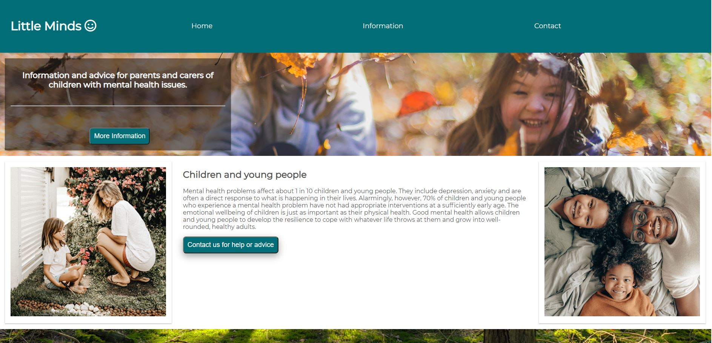

# Little Minds

This project Little minds is a website designed to help and give information to parents and carers of children with mental health issues. it contains links to useful tips and therapy booking session, videos of meditationand tips to keep a child well.

## Showcase

A deployed version of my website can be found [here.](https://melwatts.github.io/LittleMinds/)

## navigation

* [UX](#ux)
  + [UX-stories](#ux-stories)
* [Strategy](#strategy)
  + [User-needs](#user-needs)
  + [Business-vision](#business-vision)
* [Scope](#scope)
* [Structure](#structure)
* [Wireframes](#wireframes)
  + [Changes](#changes-to-wireframes)
* [Features](#features)
  + [Existing-features](#existing-features)
  + [Future-features](#futere-features)
* [Technologies](#technologies)
* [Testing](#testing)
  + [Testing-plan](#testing-plan)
  + [Implementation](#implementation)
  + [Results](#results)
* [Bugs](#bugs)
* [Deployment](#deployment)
* [Credits](#credits)
* [Content](#content)
* [Media](#media)
* [Acknowledgements](#acknowledgements)

## UX

User stories
## First time visitor goals

•	As a first time visitor, my aim is for parents  / carers of vulnerable children to feel there is help for them, they are not alone and my site will direct them to a solution
•	As a first time visitor, my aim is for people to be able to find what they are looking for very easily with an simple navigation through the site.

## Returning visitor goals:

•	As a returning visitor, my aim is for the site to be familiar and clear for the visitor to find what they were previously researching.
•	As a returning 

The end goal of the project is to help parents and carers if tehy are worreid about their childs behaviour and wellbeing. Providing them with links to professionals and youtubes vidoes of meditations and techniques.

### UX stories

* As a user I want to find help as I'm worried about my childs behaviour.
* As a user I want to find help as I'm worried about my childs wellbeing.
* As a user I want to know what help or support is out there.
* As a user I want to find out what professional therapy could I get for my loved one.
* As a user I want to find out some tips to keep my child well and happy.
* As a user I would like to feel I am not alone and things can be improved for my child and loved one.
* As a user I would like to know the signs of mental health issues so I can look out for them.

## Strategy

### User Needs

As a user the site has to be accessible on mobile, tablet and all browsers. Information should be clear to read, informative and helpful.
The site navigation needs to be optimal to move to the preferred section of the user.

### Business vision

The purpose of this project is to give users peace of mind and help is out there. 
The site also gives the users easy acces to external sites to talk to professionals, find other people to talk to in the same position, and watch meditation and mindful videos .

## Scope

I want my users to feel they are not alone, there are like minded parents / carers, professionals to talk to and generally help is out there for teh ones they love. 

## Structure

This project is a 3 page website. with the home page being things that can help keep a young people mentally well. An inforamtion page where users can find links to various other website where they will find help, chat forums and professional consultaions. The third page is a contact form this is so users can reach out to teh tam and they will guide them to teh correct help and resources.

## Wireframes

The original wireframes can be found [here](assets/images/wireframe.JPG)

### Changes to wireframes

My site has changed considerably from teh intial wireframe
